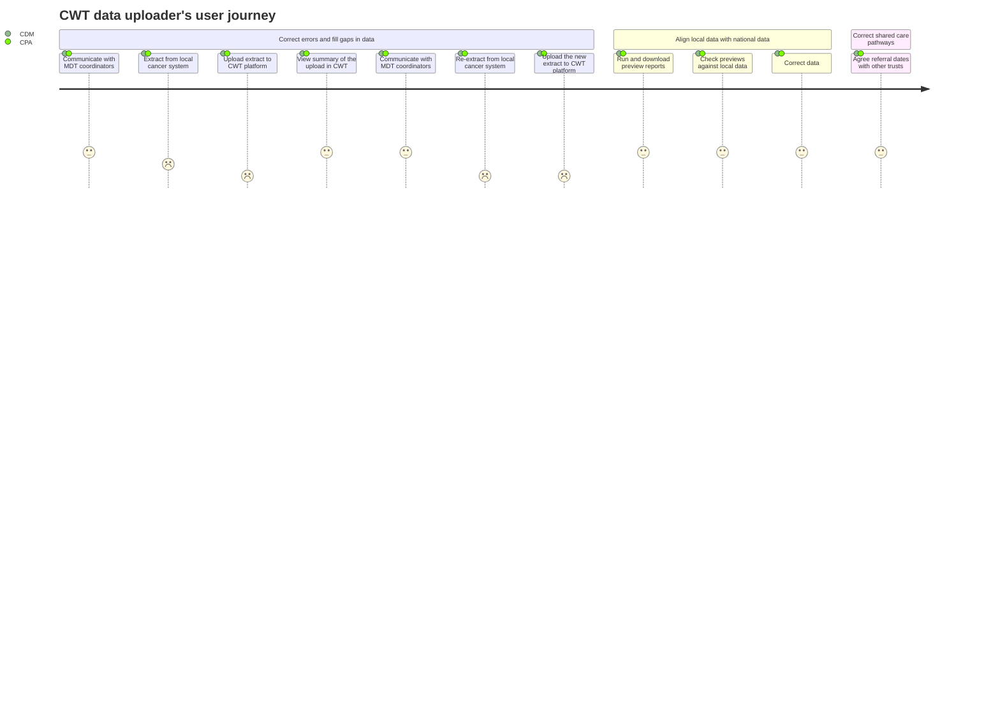

# Technical Architecture Intro

## Architecture vs Architecture Descriptions

The currency of a technical architect (TA) is an Architecture Description (AD), this is document describing a system, usually a digital software system. AD are distinct from actual software architecture, which is the "real" system itself as it exists (or will exist). AD are therefore always an approximation or version of the "truth". A key part of the architect's job is to see to it that the AD give as good a representation of the real system as possible. The set of AD describing a system is therefore never "done" and is a set of living documents.

## Type of systems architect

There are many different types of "architect" within the digital domain, these terms often overlap, and a TA may wear all these "hats" at different points.

1. Enterprise Architect - concerned with the wider context, not just software and digital systems, but capabilities of the business or organisation
2. Technical Architect - concerned with the technology choices of a system
3. Solutions Architect - concerned with the design and implementation of software systems
4. Data Architect - concerned with specification of data and its uses in a system

## As-Is vs To-Be Architecture Descriptions

Often as a TA, we need to create AD for an existing system that has grown organically and evolved in the real world. This is then a process of working backwards from the actual architecture to the As-Is AD. 

The opposite process of starting with a blank page and working towards a AD for an imagined future system, is quite different. The TA must start from first principles and develop a To-Be architecture description of the system that should be built.

## Architectural Principles

A TA does not come to a problem cold, they come with a set of principles that can help guide their decisions about an architecture. Establishing architectural principles early on in the process is important. Some examples of principles:

1. User Centred Design
2. Separation of Concerns
3. Low Coupling 
4. High Cohesion
5. Open Architecture
6. Privacy by design

## Architecture Frameworks

There are many different formal frameworks and approaches to doing systems architecture.

- [TOGAF](https://www.opengroup.org/togaf)
- [Zachman](https://www.zachman.com/about-the-zachman-framework)
- [Rosanski & Woods](https://www.viewpoints-and-perspectives.info/)
- [Krutchen 4+1](https://www.cs.ubc.ca/~gregor/teaching/papers/4+1view-architecture.pdf)
- [C4 Model](https://c4model.com/)

## Architecture Standards

The [ISO42010](http://www.iso-architecture.org/42010/) standard, defines a set of requirements for creating AD of software and enterprise architecture.

Key aspects of the standard are:
- Stakeholders
- Concerns
- Viewpoint
- Views
- Model Kind
- Model

## Stakeholders

Identifying stakeholders is a first step when creating a set of AD. Stakeholders includes anyone who has an interest in the system at hand. Stakeholders can be grouped into broad categories (following the [Rosanski & Woods approach](https://www.viewpoints-and-perspectives.info/home/stakeholders/)).

| Type                  | Description                                                                                                                    |
| --------------------- | ------------------------------------------------------------------------------------------------------------------------------ |
| Acquirers             | Oversee the procurement of the system or product                                                                               |
| Assessors             | Oversee the system’s conformance to standards and legal regulation                                                             |
| Communicators         | Explain the system to other stakeholders via its documentation and training materials                                          |
| Developers            | Construct and deploy the system from specifications (or lead the teams that do this)                                           |
| Maintainers           | Manage the evolution of the system once it is operational                                                                      |
| Production            | Engineers	Design, deploy, and manage the hardware and software environments in which the system will be built, tested, and run |
| Suppliers             | Build and/or supply the hardware, software, or infrastructure on which the system will run                                     |
| Support Staff         | Provide support to users for the product or system when it is running                                                          |
| System Administrators | Run the system once it has been deployed                                                                                       |
| Testers               | Test the system to ensure that it is suitable for use                                                                          |
| Users                 | Define the system’s functionality and ultimately make use of it                                                                |

## Concerns

Once stakeholders are identified, the TA should list out their main concerns regarding the system at hand. Often these are best written as questions the stakeholder might ask of the architecture. Examples:

- "How can I continuously deploy my changes to the system?"
- "How can I control the costs of running the system?"
- "How can I ensure the system protects the privacy of patient data?"
- "How can I produce performance charts and reports that are easy to understand?"

User needs are a very specific type of concern relating specifically to users of the system. To follow a UCD principle, user needs would be given a higher priority to other concerns.

## Mapping Stakeholders to Concerns

Concerns may be cross-cutting and shared by more than one stakeholder. To understand this a TA would map the unique concerns across the stakeholders, creating a matrix of stakeholders to concerns. For example:

|                                          | Trust   User  | Cancer Alliance   User | Digital Analytical   Team User | NHSD   Developer | PCN   User | Somerset   Developer |       
|------------------------------------------|:------------------:|:---------------------------:|:----------------------------------:|:--------------------:|:--------------:|:-------------------------:|
| How can I upload CWT data?               | &check;            | &check;                     |                                    |                      |                |                           |
| How can I monitor cancer waits?          | &check;            |                             |                                    |                      |                |                           |
| How can I report in Power BI?            |                    | &check;                     |                                    |                      |                |                           |
| How can I download datasets?             |                    | &check;                     |                                    |                      |                |                           |
| How does eRS align?                      |                    | &check;                     |                                    |                      |                |                           |
| How can I quickly answer user queries?   |                    |                             | &check;                            |                      |                |                           |
| How can I test user issues?              |                    |                             | &check;                            |                      |                |                           |
| How can I improve system knowledge?      |                    |                             | &check;                            |                      |                |                           |
| How can I access different environments? |                    |                             |                                    |  &check;             |                |                           |
| How can I see data at GP practice level? |                    |                             |                                    |                      | &check;        |                           |
| How can I ensure outputs match?          |                    |                             |                                    |                      |                | &check;                   |

## Viewpoints

In the same way a "real" architect would create elevations that depict the plans and design of a building from different directions, a systems architect will define "viewpoints" that frame set of concerns of the architecture. When following an architecture framework, the viewpoints to use will be specified by the framework. 

For example the 4+1 framework specifies 5 different viewpoints:
- Logical
- Process
- Development
- Physical
- Scenarios (this is the +1 in 4+1)

The C4 model specifies 4 viewpoints that effectively "zoom in" on the software architecture of system, starting from a high level and getting more detailed at each level:

- System Context
- Container
- Component
- Code

The C4 model is primarily concerned with the software organisation of a system, and is therefore quite static. To capture the dynamic aspects of the system it has supplementary viewpoints: Dynamic, System landscape and deployment.

Each viewpoint defines what kinds of "model" of the system can be used in a view.

## Views

From each viewpoint the TA creates a view of the system. A view will only ever have one "governing" viewpoint. A view can be made out of one or more "models" of the system. Each viewpoint defines what kinds of model of the system can be used in a view.

## Models

A model is basically a diagram of the system that goes towards creating that view of the architecture.

In everyday practical use a TA may create many "back of the envelope" or "box and stick" models of a system. We have all seen these scribbled on whiteboards and drawn in PowerPoint. The proliferation of these type of diagrams led to a desire to standardise and formalise the ways of making pictures of system architecture. This lead to the creation of the Unified Modelling Language ([UML](https://www.uml.org/)).

## Model Kinds

UML defines different types or kinds of models that can be created. Falling into two distinct categories covering structure and behaviour, each kind has a specific set of formal rules governing how a model can be depicted:

- Structural Diagrams
  - Class
  - Component
  - Deployment
  - Object
  - Package
- Behavioural Diagrams
  - Actvity
  - Communication
  - Interaction
  - Sequence
  - State
  - Timing
  - Use case
  
In addition to UML other modelling languages exist, which can help describe a system and how it works. One of the most well used that has gained popularity in business settings as it emphasises process over software structures is Business Process Modelling Notation ([BMPN](https://www.bpmn.org/))

## Modelling Tools

Some architecural frameworks are quite opinionated about the tools to use when modelling architecture, often these tools are proprietary and require training to use effectively. 

- [ArchiMate](https://certification.opengroup.org/register/archimate-tool) 
- [iServer](https://www.orbussoftware.com/iserver/)
- [Visio](https://www.microsoft.com/en-gb/microsoft-365/visio/flowchart-software/)
- [Lucidchart](https://www.lucidchart.com/pages/)

As opposed to these more fully featured toolsets there is an increasing number of light weight "diagrams as code" type tools, that enable an TA to quickly produce architectural models using simple text based markup. The advantage of these tools, aside from their ease of use, is their ability to sit alongside code in code repoistory and to keep a history of changes as simple textual diffs.

- [PlantUML](https://plantuml.com/)
- [Mermaid](https://mermaid-js.github.io/mermaid/#/) 
- [Stucturizr](https://structurizr.com/help/dsl)

### PlantUML example

### Mermaid example

## See Also

Some useful links

- Frameworks 
  - [ISO42010](http://www.iso-architecture.org/42010/)
  - [TOGAF](https://www.opengroup.org/togaf)
  - [Zachman](https://www.zachman.com/about-the-zachman-framework)
  - [Rosanski & Woods](https://www.viewpoints-and-perspectives.info/)
  - [Krutchen 4+1](https://www.cs.ubc.ca/~gregor/teaching/papers/4+1view-architecture.pdf)
  - [C4 Model](https://c4model.com/)
  

- Modelling
  - [UML](https://www.uml.org/)
  - [BMPN](https://www.bpmn.org/)
  
- Tools
  - [PlantUML](https://plantuml.com/)
  - [Mermaid](https://mermaid-js.github.io/mermaid/#/) 
  - [Stucturizr](https://structurizr.com/help/dsl)
  - [ArchiMate](https://certification.opengroup.org/register/archimate-tool) 
  - [iServer](https://www.orbussoftware.com/iserver/)
  - [Visio](https://www.microsoft.com/en-gb/microsoft-365/visio/flowchart-software/)
  - [Lucidchart](https://www.lucidchart.com/pages/)

