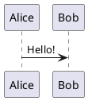

# Tooling

## Problem

How to create architecture documentation (AD) that is easy to view, edit, share and keep track of changes to?  

## Stakeholders

- A. Technical Architects
- B. Non-technical people

## Concerns

- How to share AD? (A,B)
- How to create and edit AD? (A)
- How to view AD? (A,B)
- How to track changes to AD? (A)
- How to add UML diagrams to AD? (A)
- How to keep some AD private? (A)
- How to use the local file system to organise AD? (A)

## Constraints

- MUST be able to view and edit AD in Google Workspace
- MUST be able to view and edit AD offline on a laptop
- MUST be able to see the published view of AD while editing
- MUST be able to use Plant UML diagrams
- MUST be able to view AD without requiring Github access or knowledge

## Solution Spike 1

### Overview

Following a [Documentation as Code](https://technology.blog.gov.uk/2017/08/25/why-we-use-a-docs-as-code-approach-for-technical-documentation/) approach all AD is created as [Markdown](https://www.markdownguide.org/getting-started/) (.md) files. The files are stored in Google Drive (Google Workspace) which is sync'd to the local file system using the Google Drive Agent. The files are also added to a private Github repository. Local git client is used to checkout this repository into the local sync'd copy of the Google Drive. Therefore the AD can be created and edited in place and saved to Google Drive as well as being committed to Github for change control. 

A markdown viewer add-in is added to Google Drive to enable preview of markdown files from within Google Workspace. A markdown viewer add-in is added to the local text editor Notepad++ to enable AD to be previewed when created and edited locally.

Plant UML diagrams are created as separate .puml files and stored in Google Drive and added to the private Github repository. A Github action is used to publish these files to a public Github repository from where they can be referenced as images in markdown for use in AD. Plant UML add-in is added to Chrome to enable Plant UML files to be viewed in Github as rendered diagrams.

### Tools and add-ins

Before getting started ensure you have the following set-up and installed:

- Google Workspace account
- [Google Drive Agent](https://www.google.com/drive/download/)
- [Github account](https://github.com/join)
  - With a [Personal Access Token](https://docs.github.com/en/github/authenticating-to-github/keeping-your-account-and-data-secure/creating-a-personal-access-token) (PAT) with repo access 
- [Git client](https://git-scm.com/download/win)
- [Notepad++](https://notepad-plus-plus.org/downloads/)
- [Markdown preview add-in for Notepad++](https://nea.github.io/MarkdownViewerPlusPlus/)
- [Markdown viewer add-in for Google Drive](https://workspace.google.com/marketplace/app/markee_markdown_editor/623667008977)
- [Plant UML add-in for Chrome](https://chrome.google.com/webstore/detail/plantuml-visualizer/ffaloebcmkogfdkemcekamlmfkkmgkcf)


### HOW TO - Add Markdown file to both Google Drive and Github

1. Create two repositories in Github (or re-use existing ones):
  - A public repository e.g. https://github.com/asmith-nhsx/public - for published UML
  - A private repository e.g. https://github.com/asmith-nhsx/architecture - for private AD
2. Set up your Google Drive Agent so you have drive G: mapped locally on your machine and sync'd to your Google Drive in Google Workspace
3. Clone your private Github repository into your G: drive (remember to configure your username in your git client first):
```bash
git config --global user.name <your username>
git config --global user.email <your email>
git clone https://github.com/asmith-nhsx/architecture.git
```
4. Start by creating an example Markdown file `example.md`, you can use Notepad++ to do this and save it to your G: drive locally:
```md
# Hello World!

My first example md file.
```
5. Once the file is sync'd to Google Drive you should be able to view it on Google Workspace using the Markdown viewer add-in
6. Add the file to git, commit it and then push to Github
```bash
git add --all
git commit -m "My first example md file"
git push
```
7. You should be able to view the file through the Github interface now

### HOW TO - Add Plant UML to Markdown 
1. Create a new Github action to copy Plant UML (.puml) files from your private repository to your public repository - this means you can then reference these diagrams in your markdown documents
  - In your private Github repository create a secret named `PERSONAL_TOKEN` with the value set to the PAT your created earlier
  - Under Actions, create a new workflow called (e.g. uml-publish.yml) based on this [Copy Cat action](https://github.com/andstor/copycat-action):
```yaml
name: UML Publish

# Controls when the workflow will run
on:
  # Triggers the workflow on push or pull request events but only for the main branch
  push:
    branches: 
    - main
    
  # Allows you to run this workflow manually from the Actions tab
  workflow_dispatch:

# A workflow run is made up of one or more jobs that can run sequentially or in parallel
jobs:
  # This workflow contains a single job called "build"
  copy:
    # The type of runner that the job will run on
    runs-on: ubuntu-latest

    # Steps represent a sequence of tasks that will be executed as part of the job
    steps:
    - name: Copycat
      uses: andstor/copycat-action@v3
      with:
        personal_token: ${{ secrets.PERSONAL_TOKEN }}
        src_path: /.
        file_filter: "*.puml"
        dst_path: /.
        dst_owner: <github username>
        dst_repo_name: <name of your public repository>
        dst_branch: main
        src_branch: main
        src_wiki: false
        dst_wiki: false
```
2. Create a Plant UML diagram in its own file `test.puml`, and save this to your G: drive:

2. Add the file to git, commit it and then push to Github
3. Observe the action running, once complete you should see the test.puml file has been added to your public repository
4. Reference the public copy of the raw puml file in your example markdown document using the Plant UML proxy service (as described in [this blog post](https://blog.anoff.io/2018-07-31-diagrams-with-plantuml/)):
```md
# Hello World!

My first example md file.

[Test Plant UML Diagram](http://www.plantuml.com/plantuml/proxy?cache=no&src=https://raw.githubusercontent.com/<github username>/<public repository>/<branch>/test.puml)
```
5. Observe that the rendered markdown will display the Plant UML diagram, when you update the diagram file and push to Github the diagram will be updated in the markdown file automatically thanks to the Github action pushing the changes to the public repository

## Conclusion

The proposed solution satisfies the concerns, however it does require some technical expertise to set up, but once set up should not need to be altered. Architects must still  push changes to Github to see their diagrams updated in any related AD markdown documents which is not ideal. Given that all resources are text based files (.md and .puml) change history is easily captured as diffs in Git, AD files are kept small and are easily portable between tools.

## See Also
- https://www.google.com/drive/download/ - Google Drive Agent
- https://github.com/join - Create Github account
- https://github.com/andstor/copycat-action - Copycat action used to copy UML files to the public repository
- https://docs.github.com/en/github/authenticating-to-github/keeping-your-account-and-data-secure/creating-a-personal-access-token - Creating a Github PAT 
- https://git-scm.com/download/win - Git for Windows
- https://notepad-plus-plus.org/downloads/ - Notepad++ GUI text editor with plugins
- https://github.com/mohzy83/NppMarkdownPanel Markdown Panel for Notepad++
- https://nea.github.io/MarkdownViewerPlusPlus/ - MarkdownViewer++ for Notepad++
- https://workspace.google.com/marketplace/app/markee_markdown_editor/623667008977 - Markdown viewer add-in for Google Drive
- https://chrome.google.com/webstore/detail/plantuml-visualizer/ffaloebcmkogfdkemcekamlmfkkmgkcf - Plant UML add-in for Chrome
- https://blog.anoff.io/2018-07-31-diagrams-with-plantuml/ - How to add Plant UML into Github markdown
- https://technology.blog.gov.uk/2017/08/25/why-we-use-a-docs-as-code-approach-for-technical-documentation/ - GOV.UK blog about Documentation as Code
- https://www.markdownguide.org/getting-started/ - Markdown guide
- https://guides.github.com/features/mastering-markdown/ - Github Markdown guide
- https://plantuml.com/ - Free open source tool for creating UML diagrams from simple text markup


